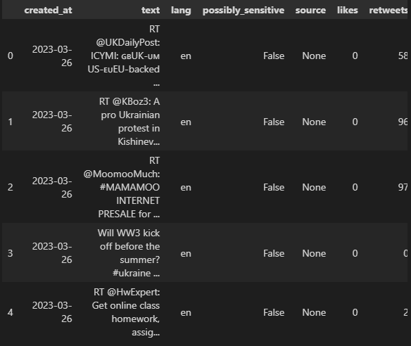
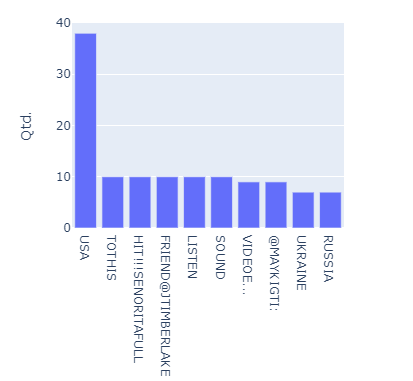
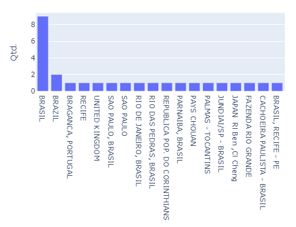
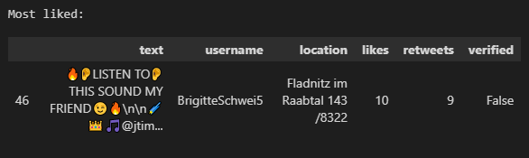
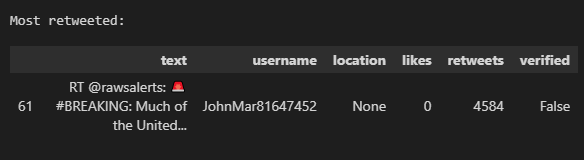
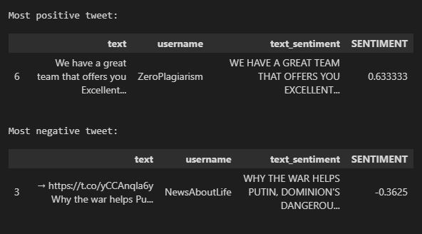
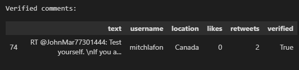

# TwitterAnalytics
Find out what's been talked about anything you want!\
Python code for tweet analysis Tweeter hashtags.

# Searching the tweets
Get a dataframe with all the tweets returned from your query, along with additional
information  

# Analysis
Discover whats are the most recurrent words used in the topic  

# Tweets by location
Find where the hashtag is being talked about more  

# Most liked and most retweeted
See the tweets with most interactions from other users  
\

# Most positive and negative tweets
Check what are the most engaged comments made  

# Verified
Get tweets from verified users  

